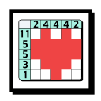
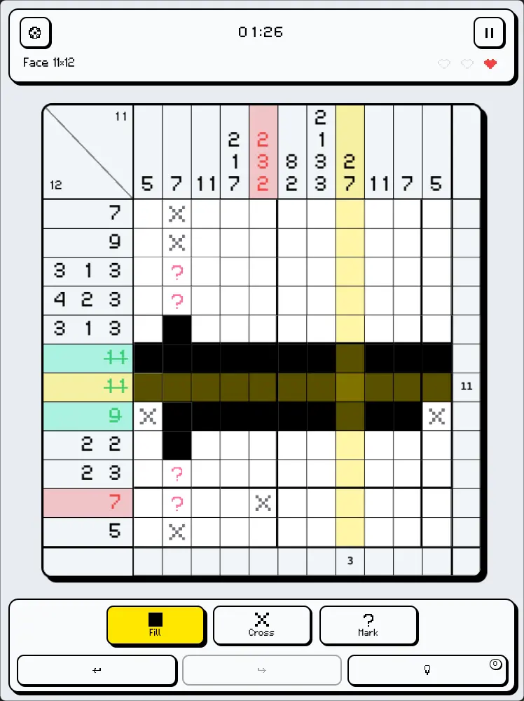
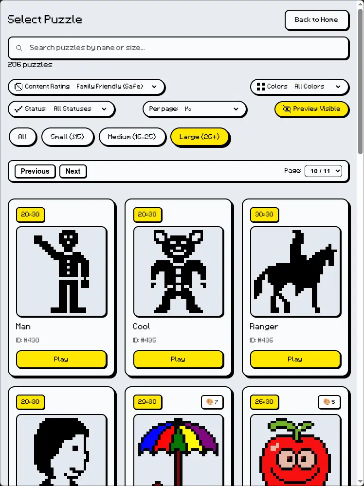

  

<h1 align="center">Nonograms</h1>

**Nonograms** (also known as Picross, Griddlers, or Hanjie) is a [webxdc](https://webxdc.org) logic puzzle game that runs inside **Delta Chat**, letting you solve Japanese pixel art puzzles.

- 🧩 **Logic Puzzles** — Solve number clues along rows and columns to uncover hidden pixel art pictures
- 📚 **Huge Puzzle Library** — Hundreds of built-in puzzles across multiple grid sizes and difficulty tiers
- 💬 **Share with Chat** — Share your solve record of each puzzle to the chat or out of webxdc as image
- 🕹️ **Fluid Controls** — Multiple input modes (Draw, Cross, Mark, Flag), drag gestures, keyboard shortcuts, and smart crosshair row/column highlighting
- 🔍 **Zoom & Pan** — Smooth pinch-to-zoom and canvas panning for comfortable solving on both mobile screens and desktop
- 💡 **Assists & Smart Clues** — Optional auto-crossing of completed lines, line validation highlights, hint system, and customizable mistake limits (3-hearts or unlimited relax mode)
- ↩️ **Undo & Redo** — Full step-by-step history and automatic progress saving so you never lose your game
- 🎵 **Interactive Audio** — Built-in retro Web Audio sound effects and celebratory victory fanfares
- 🌍 **Multi-Language** — Full internationalization (i18n) supporting with proper bidirectional rendering

## Screenshot

 

## Development

The app is written in pure **HTML / CSS / JavaScript** with zero runtime framework dependencies. Open `index.html` directly in any modern browser for local development — outside Delta Chat, a built-in `webxdc` mock fallback seamlessly manages `localStorage` persistence.

To test real chat integration, you have two options:
1. Run /git-assets/make-xdc.sh and it will create /temp/app.xdc
2. Package the app directory into a `.zip` archive, rename the extension to `.xdc`, and send it into any supported messenger(like DeltaChat).

### Adding a Language

Add a new language translation dictionary in `/scripts/i18n.js` (copy the `en` object and translate the values).

### Custom Puzzle Datasets

You can build and compress custom `puzzles.gz` dataset files using `puzzle_compressor`. It compiles raw puzzle collections from [nonograms-archive](https://github.com/Dorifor/nonograms-archive) into optimized binary compressed archives used by the game.

## Credits & Acknowledgments

- The game uses the custom pixelated typeface [Rooyin](https://github.com/MohamadDarvishi/Rooyin/).
- Built-in nonogram puzzles in this game are sourced from [nonograms-archive](https://github.com/Dorifor/nonograms-archive).
